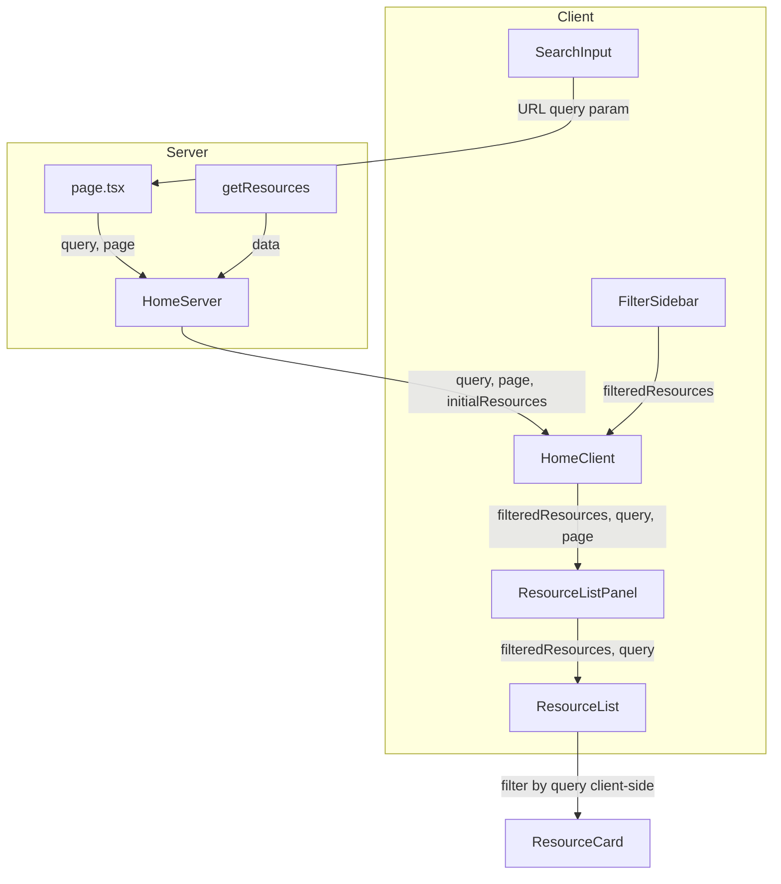

# Immediate Product Improvements Plan

## Summary of Findings

The codebase has several **critical bugs** that block core functionality and a failed build, plus quick wins that would meaningfully improve the user experience.

---

## 1. Critical: Fix Build Failure and Search Pipeline

**Current state:** The build fails due to prop mismatches, and the search feature is non-functional because the data flow is broken.

**Root cause:** [HomeClient.tsx](src/app/(homepage)/HomeClient.tsx) passes `query` and `currentPage` to [ResourceListPanel.tsx](src/app/ui/resources/ResourceListPanel.tsx), but ResourceListPanel's interface does not declare these props. Meanwhile, [ResourceList.tsx](src/app/ui/resources/ResourceList.tsx) calls `fetchFilteredResources(query, page)` which:

- Expects an object `{ query, page }`, not positional args
- Is a **server-side** async function (uses Prisma) but is invoked from a **client component** - it returns a Promise, so `ResourceCard` receives `Promise<Resource[]>` instead of actual data

**Fix approach:**

- **Restore client-side search** using the existing `filteredResources` prop (the commented-out logic in ResourceList is correct). Server-side search would require an API route or Server Action - client-side is simpler and works with current architecture.
- Wire `query` from URL search params through the component tree: HomeServer receives it from page.tsx, passes to HomeClient, which passes to ResourceListPanel and ResourceList.
- ResourceList should filter `filteredResources` by `query` (name, address, city, description) client-side - no server call needed for text search on already-fetched data.
- Remove the broken `fetchFilteredResources` call from ResourceList.
- Add `query` and `page` (or derive from `useSearchParams`) to ResourceListPanel's props and pass them to ResourceList.
- Fix HomeClient: pass `page` (not `currentPage`) and ensure HomeServer passes `query` from page props.

**Files to change:**

- [HomeServer.tsx](src/app/(homepage)/HomeServer.tsx) - Accept and pass `query` to HomeClient
- [HomeClient.tsx](src/app/(homepage)/HomeClient.tsx) - Fix prop names; pass `query` and `page` to ResourceListPanel
- [ResourceListPanel.tsx](src/app/ui/resources/ResourceListPanel.tsx) - Add `query`, `page` to props; pass to ResourceList
- [ResourceList.tsx](src/app/ui/resources/ResourceList.tsx) - Remove `fetchFilteredResources`; filter `filteredResources` by `query` client-side

---

## 2. High Impact: Debounce Search Input

**Current state:** [SearchInput.tsx](src/app/ui/SearchInput.tsx) fires `handleSearch` on every `onChange` keystroke. Each keystroke triggers `router.replace()` → full navigation and server re-render.

**Impact:** Poor UX (lag, flicker), unnecessary server load, and potential rate-limiting on navigation.

**Fix:** Debounce the search handler (e.g., 300-400ms). Use `useCallback` and a debounce utility (or `useDeferredValue` + `useTransition` for React 19). On blur or Enter key, submit immediately.

**Example pattern:**

```ts
const [localValue, setLocalValue] = useState(searchParams.get("query") ?? "");
useEffect(() => {
  const timer = setTimeout(() => handleSearch(localValue), 400);
  return () => clearTimeout(timer);
}, [localValue]);
```

---

## 3. High Impact: Empty State for "No Resources Match"

**Current state:** When filters or search return zero results, [ResourceCard](src/app/ui/resources/ResourceCard.tsx) receives an empty array and renders nothing - no feedback to the user. The README explicitly lists this as a todo.

**Fix:** In [ResourceList.tsx](src/app/ui/resources/ResourceList.tsx) or [ResourceListPanel.tsx](src/app/ui/resources/ResourceListPanel.tsx), when `filteredResources.length === 0`, render a clear message:

- "No resources match your filters. Try adjusting your search or filters."
- Include a "Clear filters" action if filters are active.

---

## 4. Quick Fix: SearchInput TypeScript and Controlled Input

**Current state:** [SearchInput.tsx](src/app/ui/SearchInput.tsx) line 6 has invalid return type syntax: `({ placeholder }): { placeholder: string }` - should be a proper props interface. Also uses `defaultValue` which doesn't sync when URL changes (e.g., when user navigates back).

**Fix:** Add proper `SearchInputProps` interface and use controlled `value` with `useSearchParams` so the input reflects URL state when it changes.

---

## 5. Optional Quick Win: Zip Code Search

**Current state:** Resource model has `address` and `city`; no dedicated zip field. Zip codes often appear in addresses. README lists "Enable zip code search" as a todo.

**Fix:** When applying the client-side search filter, also match against a zip pattern in the address (e.g., `/\b\d{5}(-\d{4})?\b/`) so queries like "10001" or "11201" return resources in that zip. Low effort, high value for NYC users.

---

## Recommended Implementation Order


| Order | Item                                                  | Effort | Impact                                        |
| ----- | ----------------------------------------------------- | ------ | --------------------------------------------- |
| 1     | Fix build + search pipeline (Section 1)               | Medium | Critical - unblocks build and restores search |
| 2     | Empty state for no results (Section 3)                | Low    | High UX                                       |
| 3     | Debounce SearchInput (Section 2)                      | Low    | High UX + perf                                |
| 4     | SearchInput TypeScript + controlled input (Section 4) | Low    | Correctness                                   |
| 5     | Zip code search (Section 5)                           | Low    | Nice-to-have                                  |


---

## Data Flow (After Fix)




---

## Out of Scope (Not Immediate)

- Server-side filtering (migrate category/borough filters to server) - larger refactor
- Marker clustering on map - mentioned in README
- 14 time inputs for business hours - schema change
- Multilingual support - planned but separate initiative

