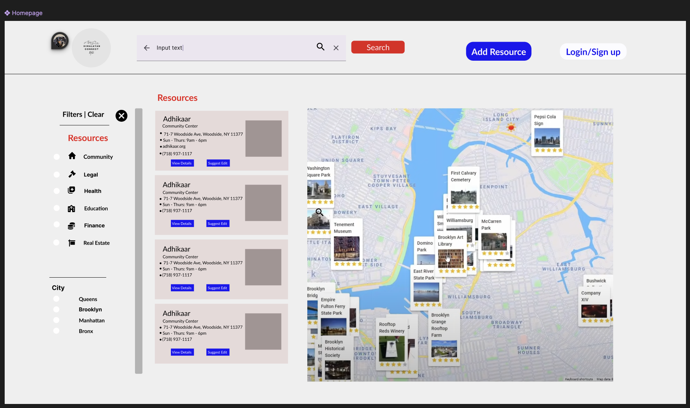
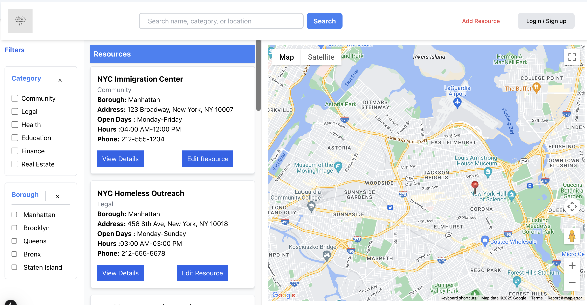
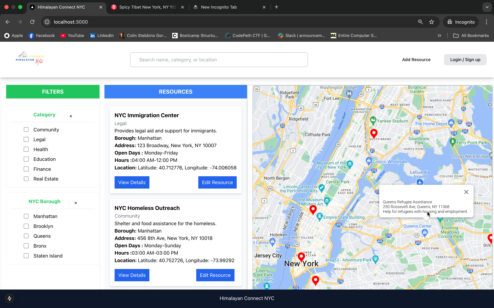
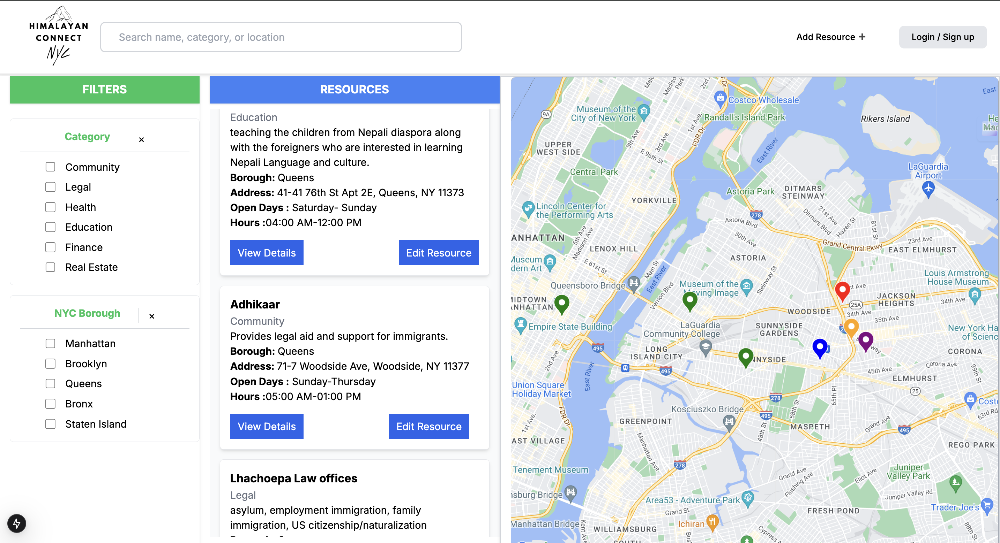

<p align ="center">
<a href = :>

# Himalayan-Connect-NYC

## Objective: 
Himalayan Connect NYC, a comprehensive and user-friendly website that connects the Himalayan community in New York with essential resources. The platform will act as a one-stop directory, specifically catering to the needs of the Himalayan community.

## Problem statement: 
The Himalayan community in New York faces significant challenges in accessing essential resources such as nonprofit services, legal assistance, immigration support, housing, and job opportunities. The information about these services is often scattered across multiple sources, making it difficult for community members, especially those with limited English proficiency or technological experience, to find the help they need. This lack of a centralized, accessible platform creates barriers to important services, hindering the community’s ability to thrive in a new environment.

By offering a streamlined platform with categorized listings, search functionality, and multilingual support, the project will empower individuals and families to easily find the services they need to succeed.

## Key Features 

1. Resource Directory: A categorized directory of nonprofit organizations, community services, law firms, immigration resources, jobs, and rental listings tailored for the Himalayan community.
2. Search and Filters: A powerful search function and filters to help users find specific services or organizations quickly.
3. Multilingual Support: Basic support for multiple languages, including Nepali, to cater to the community’s diverse linguistic needs.

## Design

#### Wireframe 
- [Himalayan Connect NYC FIGMA wireframe](https://www.figma.com/design/rv1wIJmRVMcct15TuFCCBe/Himalayan-Connect-NYC-Website-UI?m=auto&t=NicB32WCserygMbc-1)


### Progress
<p align="center">
  <figure style="display: inline-block; text-align: center; margin: 10px;">
    
    <figcaption>Homepage v0</figcaption>
  </figure>
  <figure style="display: inline-block; text-align: center; margin: 10px;">
    
    <figcaption>Homepage v1</figcaption>
  </figure>
   <figure style="display: inline-block; text-align: center; margin: 10px;">
    
    <figcaption>Homepage v2</figcaption>
  </figure>
</p>

|Task Name|Description|Example|
|--- | --- |---|
|Design Database Schema | 
|Data source|
|User Flows
|Set up backend and database|
|Set up frontend|
|User Authentication| 

### External API
- Google Maps API
  - Directions 
  - Geocoding
  - Maps Javascript API
  - Places API


This is a [Next.js](https://nextjs.org) project bootstrapped with [`create-next-app`](https://nextjs.org/docs/app/api-reference/cli/create-next-app).

## Getting Started

First, run the development server:

```bash
npm run dev
# or
yarn dev
# or
pnpm dev
# or
bun dev
```

Open [http://localhost:3000](http://localhost:3000) with your browser to see the result.

You can start editing the page by modifying `app/page.tsx`. The page auto-updates as you edit the file.

This project uses [`next/font`](https://nextjs.org/docs/app/building-your-application/optimizing/fonts) to automatically optimize and load [Geist](https://vercel.com/font), a new font family for Vercel.

## Learn More

To learn more about Next.js, take a look at the following resources:

- [Next.js Documentation](https://nextjs.org/docs) - learn about Next.js features and API.
- [Learn Next.js](https://nextjs.org/learn) - an interactive Next.js tutorial.

You can check out [the Next.js GitHub repository](https://github.com/vercel/next.js) - your feedback and contributions are welcome!

## Deploy on Vercel

The easiest way to deploy your Next.js app is to use the [Vercel Platform](https://vercel.com/new?utm_medium=default-template&filter=next.js&utm_source=create-next-app&utm_campaign=create-next-app-readme) from the creators of Next.js.

Check out our [Next.js deployment documentation](https://nextjs.org/docs/app/building-your-application/deploying) for more details.
